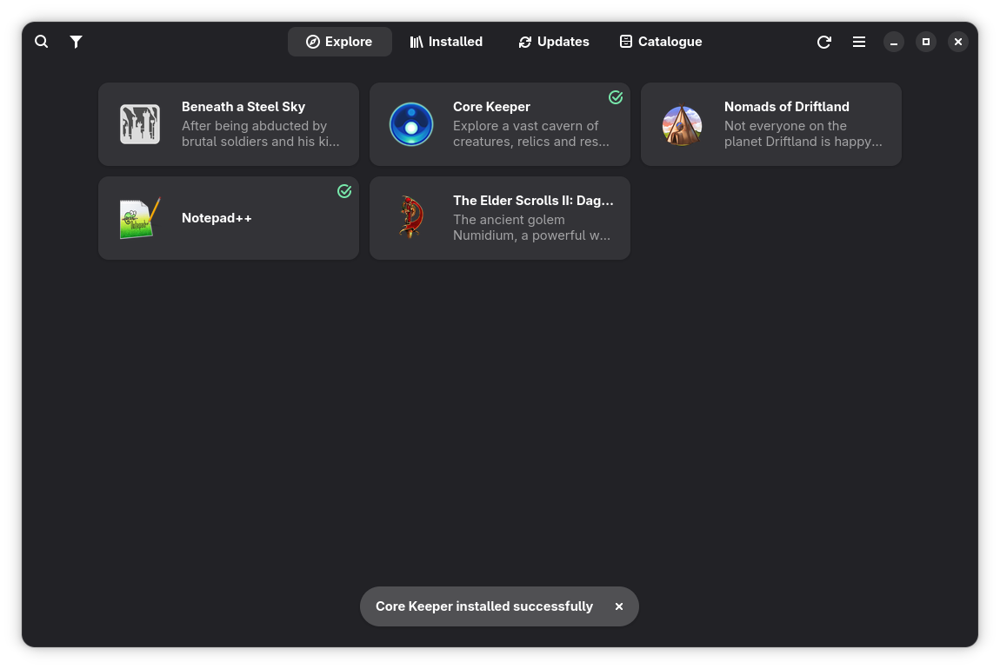
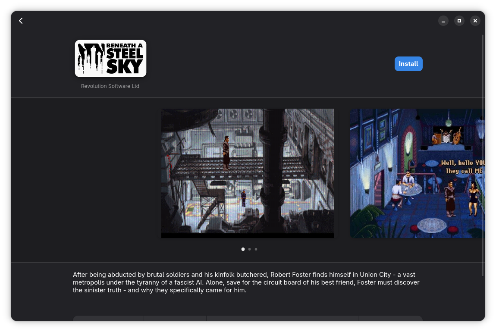
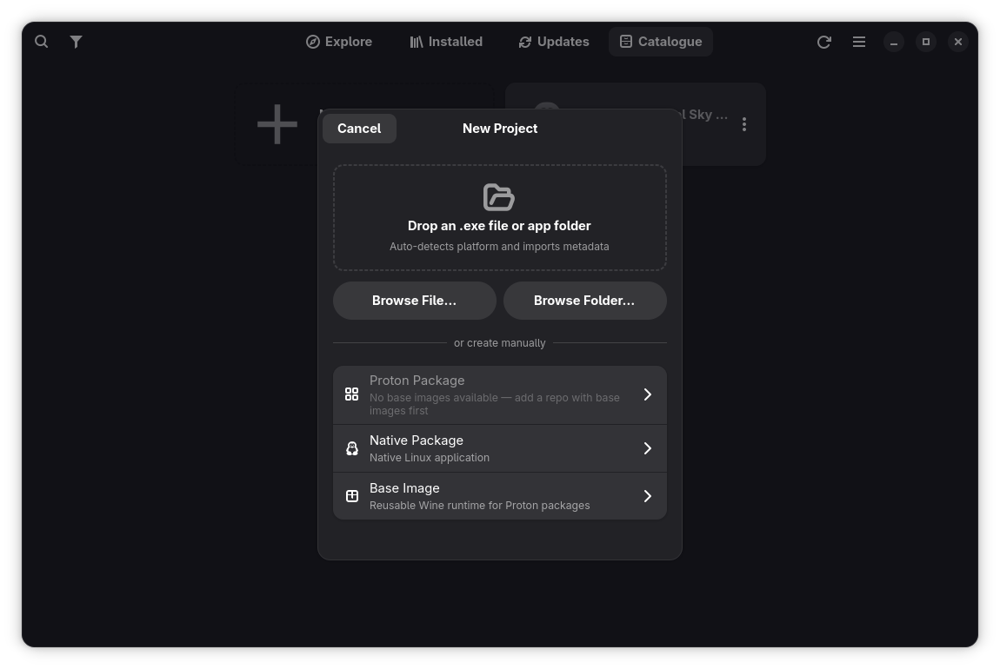
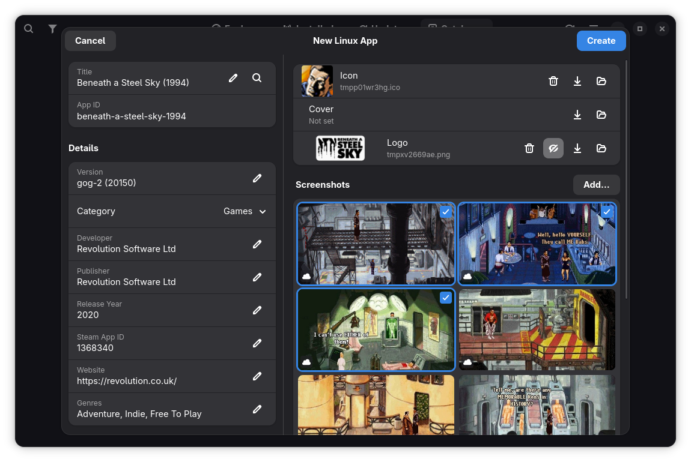

# Cellar

A GNOME desktop application that acts as a private software storefront for
Windows, Linux and DOS games and applications. Think GNOME Software, but the "packages" are
pre-configured app archives stored on a network share or web server.

The primary use case is a home-lab or family server: a maintainer packages and
publishes apps from their machine using the built-in Package Builder; everyone
else browses the catalogue and installs with one click.

Windows apps run via [umu-launcher](https://github.com/Open-Wine-Components/umu-launcher)
with [GE-Proton](https://github.com/GloriousEggroll/proton-ge-custom).
Linux native apps are extracted and launched directly.
DOS games run via [DOSBox Staging](https://dosbox-staging.github.io/)
(auto-downloaded on first use).

---

## Screenshots

| Browse catalogue | App detail |
|---|---|
| [](https://raw.githubusercontent.com/macaon/cellar/main/docs/screenshots/explore.png) | [](https://raw.githubusercontent.com/macaon/cellar/main/docs/screenshots/detail.png) |

| Package builder | Metadata editor |
|---|---|
| [](https://raw.githubusercontent.com/macaon/cellar/main/docs/screenshots/builder.png) | [](https://raw.githubusercontent.com/macaon/cellar/main/docs/screenshots/metadata.png) |

---

## Features

**Browsing & discovery**
- GNOME Software-style grid with Explore, Installed, and Updates tabs
- Card view (compact) and capsule view (Steam-style portrait covers)
- Filter by category, genre, platform (Windows/Linux/DOS), or repository
- Full-text search across app names and summaries
- Update badge on the Updates tab with automatic CRC32 change detection

**Installing & running**
- One-click install, update, and remove
- Delta packages — shared base images keep downloads small (typically 50–500 MB vs 2–3 GB)
- Chunked downloads with per-chunk CRC32 verification (~1 GB each)
- Multi-target launch — apps with multiple entry points (e.g. game, editor, launcher) show a picker
- Per-app launch parameters — override DXVK, VKD3D, audio driver, and debug flags
- Runner management — browse and install GE-Proton versions from GitHub Releases
- Desktop shortcuts with support for multiple launch targets
- Backup and import user files — export modified saves/configs as `.tar.zst`, restore later
- Open install folder from the detail view
- Offline mode — cached catalogue allows browsing and launching when the repo is unreachable

**DOS games**
- GOG DOSBox games auto-detected during import and converted to native DOSBox Staging packages
- DOSBox Settings dialog — machine type, CPU speed, display, shaders, sound, MIDI (FluidSynth/MT-32), and mixer effects
- DOSBox Staging runtime auto-downloaded from GitHub Releases on first use

**For maintainers** (requires a writable repo)
- Package Builder with four project types: Windows (Proton), Linux (native), DOS, and Base Image
- Smart import — drag-and-drop a folder, installer, or GOG game onto the New Project dialog; platform auto-detected
- Initialise a WINEPREFIX, install winetricks dependencies, run `.exe` installers, configure launch targets, test-launch, and publish
- Steam Store metadata lookup — auto-fill title, description, cover art, and screenshots
- Edit metadata and delete entries directly from the detail view or the builder
- Delta archive creation — automatic BLAKE2b diff against a base image
- Configurable install location (Settings) with auto-migration of existing installs

---

## How it works

Cellar organises Windows app packages into a three-tier dependency chain:

```
Runner  (GE-Proton10-32)                     ← GE-Proton binary
  ↑
Base    (GE-Proton10-32-allfonts)            ← clean WINEPREFIX + shared deps
  ↑
App     (my-game)                            ← delta archive (changes only)
```

A **runner** is a GE-Proton build. A **base image** is a clean WINEPREFIX
created with that runner plus shared dependencies (fonts, runtimes via
winetricks). An **app** is a delta archive containing only the files that
differ from its base — typically 50–500 MB instead of the full 2–3 GB prefix.

At install time, Cellar seeds a new prefix from the base using copy-on-write
(reflinks on btrfs/XFS, regular copy elsewhere), then overlays the delta.
Archives are split into ~1 GB chunks so only one chunk needs to be on disk at
a time.

Linux native apps and DOS games skip this hierarchy — they're just extracted
and launched directly.

For the full technical details, see [docs/INTERNALS.md](docs/INTERNALS.md).

---

## Guides

### Setting up a repository

A Cellar repository is just a directory — local or remote — that holds a
`catalogue.json` index and app assets.

1. **Create the directory.** Any writable location works: a local path, an
   SFTP server, or an SMB share.
2. **Add it in Cellar.** Open Preferences → Repositories → Add. Enter the
   URI (e.g. `/mnt/nas/cellar`, `sftp://alice@nas/srv/cellar`,
   `smb://nas/cellar`).
3. **Cellar initialises it automatically.** If no `catalogue.json` exists,
   Cellar offers to create one with an empty skeleton.

For HTTP-served repos, point a web server at the directory. HTTP repos are
read-only — publish via a writable transport and serve over HTTP for users.
See [docs/AUTH.md](docs/AUTH.md) for bearer token setup with nginx or Caddy.

### Building and publishing a base image

A base image is a shared WINEPREFIX that Windows app packages build on top of.
Create one before publishing any Windows app packages.

1. Open the **Package Builder** tab → **New Project** → select **Base Image**.
2. Choose a GE-Proton runner from the list — Cellar downloads it if needed.
3. Click **Initialise** to create an empty WINEPREFIX with that runner.
4. Use the **Dependencies** section to install shared libraries via winetricks
   (fonts, Visual C++ runtimes, .NET, DirectX, etc.).
5. Click **Publish** and choose the target repo.

### Building and publishing a Windows app

1. Open the **Package Builder** → **New Project** → select **Proton App**
   (or drag-and-drop an installer / game folder onto the dialog — Cellar
   auto-detects the platform).
2. **Select your base image** from the dropdown.
3. **Install the application** — run a `.exe`/`.msi` installer inside the
   prefix, drag additional files onto the drop zone (DLC, patches), or use
   "Browse Prefix" to place files manually.
4. **Configure launch targets** — Cellar scans for new executables after each
   install and offers to add them. You can also add targets manually.
5. **Test-launch** from the builder to verify everything works.
6. **Fill in metadata** — title, category, description, icon, cover, and
   screenshots. Use the Steam lookup button to auto-fill from the Steam Store.
7. Click **Publish**. Cellar automatically computes the delta against the base
   image — only changed files are included.

### Building and publishing a Linux or DOS app

1. **New Project** → select **Native App** or **DOS App** (or drop a folder /
   GOG game — GOG DOSBox games are auto-detected and converted).
2. **Set the source folder** containing the app or game files.
3. **Configure launch targets** and **fill in metadata** as above.
4. Click **Publish**.

---

## Supported repo transports

| Scheme | Example | Writable |
|---|---|---|
| Local path | `/mnt/nas/cellar` | Yes |
| `file://` | `file:///mnt/nas/cellar` | Yes |
| `http://` / `https://` | `https://cellar.home.arpa/repo` | No |
| `sftp://` | `sftp://alice@nas.home.arpa/srv/cellar` | Yes |
| `smb://` | `smb://nas.home.arpa/cellar` | Yes |

- **HTTP(S)** — read-only with optional [bearer token auth](docs/AUTH.md).
- **SFTP** — pure-Python via paramiko. Key auth via ssh-agent or `~/.ssh/config`.
- **SMB** — pure-Python via smbprotocol (SMBv2/v3). No GVFS mount required.

Credentials are stored per-repo via libsecret (system keyring) with a
plaintext fallback when no secret daemon is available.

---

## Tech stack

- **Language:** Python 3.10+
- **UI toolkit:** GTK4 + libadwaita 1.4+ (GNOME 45+)
- **Windows compatibility:** [umu-launcher](https://github.com/Open-Wine-Components/umu-launcher) + GE-Proton
- **DOS compatibility:** [DOSBox Staging](https://dosbox-staging.github.io/) (auto-downloaded runtime)
- **Runner index:** GitHub Releases API (GloriousEggroll/proton-ge-custom), cached in memory
- **Local data:** SQLite via `sqlite3` stdlib
- **Network I/O:** `requests` for HTTP/HTTPS; `paramiko` (pure Python) for SFTP/SSH; `smbprotocol` for SMB
- **Credentials:** `gi.repository.Secret` (libsecret / GNOME Keyring / KWallet portal); falls back to `config.json` (chmod 0600)
- **Image handling:** Pillow (load, resize, crop, ICO/BMP→PNG, optimise)
- **Archive handling:** `tarfile` stdlib; `zstandard` for `.tar.zst` archives
- **File sync:** `rsync` subprocess; Python fallback if rsync is absent
- **Metadata:** Steam Store API (no authentication required)

---

## Installation

### System requirements

- Python 3.10+
- GTK 4.0+ and **libadwaita 1.4+** (ships with GNOME 45 / Ubuntu 24.04 / Fedora 39+)

> **Note for Pop_OS / Ubuntu 22.04 users:** the default libadwaita on these
> distros is 1.2, which is too old.  The app uses `AdwNavigationView`
> (libadwaita 1.4) as its navigation backbone — replacing it with the
> deprecated `AdwLeaflet` would be significant work.  The recommended path
> for older distros is to wait for the Flatpak (which bundles its own
> libadwaita), or upgrade to Ubuntu 24.04 / Pop_OS 24.04.

**Fedora / RHEL 9+:**
```bash
sudo dnf install python3-gobject libadwaita
```

**Ubuntu 24.04+ / Debian bookworm+:**
```bash
sudo apt install python3-gi gir1.2-adw-1
```

### Install

```bash
git clone https://github.com/macaon/cellar
cd cellar
pip install --user .
```

This installs the `cellar` command to `~/.local/bin/` and registers the app
in the GNOME application launcher. Make sure `~/.local/bin` is on your `PATH`
(add `export PATH="$HOME/.local/bin:$PATH"` to `~/.bashrc` if not).

### Flatpak

A Flatpak manifest is available at `flatpak/io.github.cellar.json`.

```bash
flatpak-builder --user --install --force-clean --disable-cache \
    cellar-build flatpak/io.github.cellar.json
flatpak run io.github.cellar
```

### Launch

- **Terminal:** `cellar`
- **App drawer:** search for *Cellar* in GNOME Activities

---

## Running in development

```bash
git clone https://github.com/macaon/cellar
cd cellar
pip install requests Pillow zstandard smbprotocol paramiko pytest
PYTHONPATH=. CELLAR_REPO=tests/fixtures python3 -m cellar.main
```

`CELLAR_REPO` accepts a local path or any supported URI. The test fixtures
under `tests/fixtures/` work out of the box for local development.

```bash
PYTHONPATH=. python3 -m pytest tests/ -v
```

---

## Desktop environment compatibility

| Feature | GNOME | KDE |
|---|---|---|
| Browse, install, update (HTTP(S) / SSH repo) | Yes | Yes |
| Browse, install, update (local path) | Yes | Yes |
| SMB repos | Yes | Yes |
| Visual integration | Native Adwaita | Renders with Adwaita styling |

---

## Further reading

- [docs/REPO_FORMAT.md](docs/REPO_FORMAT.md) — catalogue schema and field reference
- [docs/INTERNALS.md](docs/INTERNALS.md) — chunked archives, delta packages, safe updates, local data layout
- [docs/AUTH.md](docs/AUTH.md) — bearer token authentication with nginx and Caddy

---

## License

GPL-3.0-or-later

---

## Acknowledgements

Cellar is built on the work of many open-source projects:

- **[GTK](https://gtk.org/)** and **[libadwaita](https://gnome.pages.gitlab.gnome.org/libadwaita/)** — UI toolkit and GNOME platform library
- **[umu-launcher](https://github.com/Open-Wine-Components/umu-launcher)** — unified Wine/Proton launcher
- **[GE-Proton](https://github.com/GloriousEggroll/proton-ge-custom)** — custom Proton builds by GloriousEggroll
- **[DOSBox Staging](https://dosbox-staging.github.io/)** — modern DOS emulator (transparent runtime for DOS games)
- **[NoUniVBE](https://github.com/LowLevelMahn/NoUniVBE)** — UniVBE bypass for GOG DOS games
- **[Pillow](https://python-pillow.org/)** — image processing
- **[paramiko](https://www.paramiko.org/)** — pure-Python SSHv2
- **[smbprotocol](https://github.com/jborean93/smbprotocol)** — pure-Python SMBv2/v3
- **[zstandard](https://github.com/indygreg/python-zstandard)** — Zstandard compression bindings
- **[RapidFuzz](https://github.com/rapidfuzz/RapidFuzz)** — fuzzy string matching (MIT)
- **[Requests](https://docs.python-requests.org/)** — HTTP client
- **[PyGObject](https://pygobject.gnome.org/)** — Python bindings for GLib/GTK/GStreamer

Tab and category icons are [CC0-1.0](https://creativecommons.org/publicdomain/zero/1.0/) sourced from the GNOME icon set.

---

## AI assistance

This application was developed with the help of [Claude](https://claude.ai) by Anthropic. Claude assisted with architecture decisions, implementation, and debugging throughout the project.
